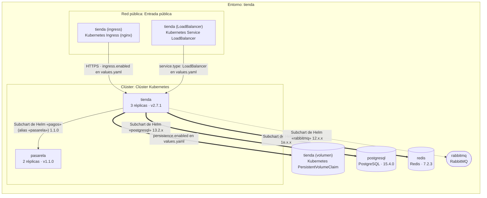

# Módulo de plataforma

[← Índice de la documentación](../indice.md)

Quinta especialidad de la suite (`--module platform`): modela **dónde corre cada cosa y cómo llega hasta ahí**: entornos, redes, recursos aprovisionados, servicios, despliegues, dependencias y pipelines. Vive en `packages/domain-platform`, sin depender del código de los demás módulos; se enlaza con ellos por URN (`urn:iark:integration:<id>`).

Documento JSON (ejemplo completo en [`examples/plataforma-ejemplo.json`](../../examples/plataforma-ejemplo.json), esquema con `iark schema --module platform`):

| Parte | Contenido |
|---|---|
| `environments` | `dev`, `test`, `staging`, `prod` o `dr`, con `provider` y `region` |
| `networks` | redes de un entorno, anidables (`parentId`), con `exposure` (`public`, `private`, `isolated`) y `cidr` |
| `resources` | recursos de un entorno y, si procede, de una red: `cluster` y `vm` (los únicos **anfitriones**), `database`, `cache`, `queue`, `storage`, `load-balancer`, `gateway`, `dns`, `secret-store`, `registry`; con `status` (`planned`, `provisioned`, `decommissioned`), `iac` y `counterpartOf` (su equivalente en otro entorno, ver [Equivalencias entre entornos](#equivalencias-entre-entornos-counterpartof)) |
| `services` | `service`, `worker`, `job` o `frontend`, con `owner`, `criticality` y `external` (SaaS de terceros: no se despliega) |
| `deployments` | dónde corre un servicio en un entorno: `hostId` (un clúster o una máquina **de ese entorno**), `replicas` y `version` |
| `dependencies` | de quién depende un servicio o un recurso: `calls` (síncrona), `messages` (asíncrona) o `data`, con `protocol` |
| `pipelines` | `ci`, `cd`, `ci-cd` o `iac`: los servicios que construyen o despliegan, los recursos que aprovisionan y los entornos por los que promocionan (`stages`, con `approval` manual) |

No se guardan coordenadas: las vistas se derivan del modelo. `topology` es el grafo de servicios y recursos con sus dependencias, `env:<id>` el **despliegue de un entorno** (las redes y los clústeres son recuadros anidados que contienen los recursos y las instancias de cada servicio, con sus réplicas y versión) y `delivery` la **entrega continua** (pipelines con sus pasos por entorno). El impacto de un servicio o recurso se pide por su id: `impact:<id>` (lo que depende de él), `depends:<id>` (de qué depende) y `focus:<id>` (ambos); un recurso, o un servicio que corre en un solo entorno, se acota a ese entorno.

`validate` comprueba la estructura (ids únicos entre tipos, redes sin ciclos, despliegues en un clúster o máquina del mismo entorno, referencias, equivalencias entre entornos) y aplica reglas de **gobierno**: servicios sin despliegue o sin responsable (aviso si son altos o críticos), producción sin pasar por un entorno anterior, dependencias de recursos previstos o dados de baja, de servicios que no corren en el mismo entorno o de recursos de otro entorno, tipos de recurso (base de datos, cola…) que un servicio usa en un entorno y no en otro, datos o secretos en una red pública, producción sin infraestructura como código, puntos únicos de fallo (una réplica de un servicio crítico), clústeres vacíos y recursos que nadie usa, llamadas circulares y pipelines sin aprobación manual en producción, sin servicios o que despliegan donde el servicio no corre.

```bash
iark validate  plataforma.json --module platform
iark convert   plataforma.json --module platform --out topologia.svg                   # topología; también .mmd y .drawio (una página por vista)
iark convert   plataforma.json --module platform --out produccion.svg --view env:prod
iark convert   plataforma.json --module platform --out entrega.svg --view delivery
iark convert   plataforma.json --module platform --out impacto.svg --view impact:kafka-prod
iark import    produccion.mmd --module platform --out plataforma.json                  # flowchart → documento
iark import    main.tf        --module platform --out plataforma.json                  # Terraform (.tf, .tf.json, estado o plan) → documento
iark import    infra/         --module platform --format terraform --out plataforma.json   # todos los *.tf de una carpeta (o varios archivos .tf) como un solo stack
iark import    despliegue.yaml --module platform --format kubernetes --out plataforma.json   # manifiestos de Kubernetes → documento
iark import    plantilla.yaml --module platform --format cloudformation --out plataforma.json   # plantilla de AWS CloudFormation (YAML o JSON) → documento
iark import    mi-chart/      --module platform --format helm --out plataforma.json         # chart de Helm sin renderizar (Chart.yaml + values.yaml) → documento
helm template mi-release ./mi-chart -f values-prod.yaml | iark import --module platform --stdin   # lo que Helm genera de verdad = Kubernetes
iark generate  "Tienda con Kubernetes, PostgreSQL y Kafka en desarrollo y producción" --module platform --json plataforma.json
iark platform deployments plataforma.json                                              # dónde corre cada servicio en cada entorno y qué versiones difieren
iark platform compare     dev prod plataforma.json                                     # compara dos entornos: lo que solo está en uno y las versiones o réplicas que difieren; dice cómo emparejó cada recurso si no fue por nombre (o si lo declara el recurso: counterpartOf)
iark platform impact      kafka-prod plataforma.json [--direction dependencies|both] [--env prod]   # qué se cae si falla, con los responsables a avisar
iark platform from-integration mapa.json                                               # sistemas de un mapa de integración → servicios y recursos con URN
```

Al importar un `flowchart`, los `subgraph` con el prefijo que pone el exportador se reconocen como `Entorno: …`, `Red pública|privada|aislada: … (cidr)` y `Clúster: …` / `Máquina virtual: …`; un servicio dentro de un clúster queda desplegado en él (con `3 réplicas · v1.4.2` al final del texto) y los servicios con el mismo nombre en varios entornos son uno solo con varios despliegues. El tipo de cada nodo sale de su clase (`:::database`, `:::worker`, `:::external`; también en español) y, si no, de su forma (`[( )]` = base de datos, `([ ])` = cola); `class X planned|decommissioned` da el estado del recurso. Las flechas son dependencias: continua = llama, punteada = mensajes, gruesa = datos, con la etiqueta `protocolo · descripción`. Los pasos de la vista de entrega continua no se importan. El banco de trabajo (`modulos.html?module=platform`) lo edita en un lienzo propio, con paleta de figuras, panel de propiedades, deshacer/rehacer y autolayout (ver [Suite web](../suite-web.md)).

**Importar Terraform y Kubernetes** (`--format terraform|kubernetes|auto`; también en la pestaña «Importar» y con «Abrir archivo…», que reconoce por su contenido un `.tf.json` o un plan JSON). Terraform acepta `.tf` (HCL con un analizador propio y tolerante), `.tf.json`, el estado `.tfstate` v4 y `terraform show -json` (en un plan, los recursos salen como previstos o retirados), de las familias `aws`, `azurerm` y `google`. El entorno sale de `var.environment`, los locals, las etiquetas, el workspace o el nombre del archivo (con aviso cuando se deduce de este último); las VPC, VNet y subredes son redes anidadas con su CIDR, públicas si algo lo dice (IP pública al lanzar, ruta a un internet gateway, etiqueta de balanceador público, nombre «public» o «dmz») y privadas con aviso si nada lo dice; los clústeres, máquinas y demás recursos van a su clase (`iac: true`); las referencias, `depends_on`, grupos de seguridad (con puerto), listeners y DNS son dependencias. Kubernetes acepta YAML multidocumento, `kind: List` de `kubectl` y JSON: un namespace con nombre de entorno es un entorno (si no, hay uno solo, con aviso y con un clúster implícito); Deployment, StatefulSet, DaemonSet, CronJob y Job son servicios con su despliegue (réplicas, versión de la imagen, límites sumados; el HPA fija las réplicas mínimas), las cargas con imagen conocida (postgres, redis, rabbitmq, kafka, minio…) son recursos, Ingress, Gateway API y Service `LoadBalancer` son recursos en una red pública, y del Secret solo se guardan el tipo y los nombres de clave, **nunca los valores**; las variables de entorno (también desde ConfigMap), los `args`, los selectores y los volúmenes son dependencias. Los valores del estado o del plan de Terraform (contraseñas, claves) tampoco se leen. Lo que no se mapea (tipos desconocidos, recursos de soporte como IAM y rutas, `data`, módulos sin resolver, `count`/`for_each` sin evaluar, líneas de HCL que no se entienden con su número, kinds sin mapear, hosts externos…) va agrupado a los avisos. Un archivo roto termina con el código 2 y su línea. **Varios `.tf`**: `iark import <carpeta|a.tf b.tf…> --module platform --format terraform` los lee juntos como un solo stack (la carpeta no es recursiva; se ordenan por nombre, así que el resultado no depende del orden de los argumentos; los `.tf.json` y `.tfstate` no se juntan, avisa de ellos), y «Abrir archivo a importar…» del banco admite selección múltiple; los avisos y errores de HCL llevan el archivo (`red.tf, línea 12: …`). Limitaciones: los módulos locales no se resuelven y un archivo subido en el navegador solo trae el nombre base, así que un `main.tf` da un sistema llamado `main`.

## Importar CloudFormation y Helm

Dos formatos más de infraestructura como código (`--format cloudformation|helm|auto`; también en la pestaña «Importar» y con «Abrir archivo…»), con las mismas reglas que Terraform y Kubernetes: nada de red ni de disco, lo que no entra se avisa y los secretos no se copian.

### AWS CloudFormation

Una plantilla en **YAML** (con las etiquetas cortas `!Ref`, `!GetAtt`, `!Sub`, `!Join`…, que se leen como datos y se pasan a su forma larga; nunca se ejecutan) o en **JSON**. `auto` la reconoce por el contenido (`AWSTemplateFormatVersion`, o una sección `Resources` con tipos `AWS::…` o `Custom::…`), así que una plantilla JSON no necesita una extensión especial; `.yaml`, `.yml`, `.template` y `.cfn` también valen. Es el equivalente del importador de Terraform, con la misma correspondencia:

| CloudFormation | Documento de plataforma |
|---|---|
| la plantilla entera | **un** entorno. Su nombre sale, por este orden, de un parámetro `Environment`/`Env`/`Stage` con valor por defecto, de la etiqueta `Environment` más frecuente o del nombre del archivo (con aviso); el proveedor es `aws` y la región sale de las zonas de disponibilidad |
| `AWS::EC2::VPC` y `AWS::EC2::Subnet` | red contenedora y subredes hijas, con su CIDR. Una subred es pública si `MapPublicIpOnLaunch: true`, si su tabla de rutas llega a un internet gateway o si su nombre o etiqueta lo dicen («public», «dmz»), y privada en los casos contrarios; si nada lo dice, privada y se avisa |
| EKS, clúster de ECS, EC2, Auto Scaling | recurso `cluster` o `vm` |
| RDS, DynamoDB, ElastiCache, SQS, SNS, MSK, S3, balanceadores, API Gateway, CloudFront, Route 53, Secrets Manager, KMS, ECR, ACM, CloudWatch | recurso de su clase (`database`, `cache`, `queue`, `storage`, `load-balancer`, `gateway`, `dns`, `secret-store`, `registry`…), todos con `iac: true`; las funciones de Lambda y Step Functions son recursos `other` |
| `AWS::ECS::Service` | servicio + despliegue en su clúster: réplicas = `DesiredCount`, versión = etiqueta de la imagen, CPU y memoria de su definición de tarea |
| `Ref`, `Fn::GetAtt`, `Fn::Sub` (`${Recurso.Atributo}`) y `DependsOn` | dependencia: `data` hacia bases de datos, cachés y almacenes; `messages` hacia colas; `calls` hacia lo demás. Se siguen a través de definiciones de tarea, plantillas de lanzamiento, versiones y alias de Lambda |
| reglas de ingreso de grupos de seguridad | dependencia de quien pertenece al grupo origen hacia quien pertenece al destino, con el puerto |
| listeners y grupos de destino de un balanceador | dependencia balanceador → lo que sirve, con el protocolo del listener |
| registros de Route 53, orígenes de eventos y permisos de Lambda, suscripciones de SNS, métodos e integraciones de API Gateway | dependencia entre los dos elementos que unen |

Lo que **no** se importa y se avisa (agrupado y con su cuenta): los tipos desconocidos; los recursos de soporte (IAM, grupos de seguridad, rutas, listeners, permisos, alarmas…), que solo se consultan para deducir redes, exposición y dependencias; las **pilas anidadas** (`AWS::CloudFormation::Stack`: su `TemplateURL` no se descarga); los recursos personalizados (`Custom::…`); `Transform` (SAM, `Fn::ForEach`) y `Fn::ImportValue`, que no se expanden ni se resuelven; las **condiciones** (`Conditions`, `Fn::If`), que no se evalúan, así que un recurso condicional se importa como si se creara siempre; `Mappings` y `Fn::FindInMap`; las referencias a recursos que no existen; y las secciones que no se interpretan (`Outputs`, `Metadata`, `Rules`, `Hooks`, `Globals`). Los parámetros con `NoEcho` y las contraseñas nunca se copian: solo se leen las propiedades que se mapean.

```console
$ iark import tienda-aws.yaml --module platform --format cloudformation --out plataforma.json
aviso: 14 recursos de soporte que no se dibujan (solo se consultan para deducir redes, exposición y dependencias): AWS::EC2::InternetGateway, AWS::EC2::VPCGatewayAttachment, AWS::EC2::RouteTable, AWS::EC2::Route, AWS::EC2::SubnetRouteTableAssociation, AWS::EC2::SecurityGroup ×3, AWS::RDS::DBSubnetGroup, AWS::IAM::Role, AWS::Lambda::EventSourceMapping, AWS::Route53::RecordSet, AWS::CloudWatch::Alarm, AWS::CloudTrail::Trail.
aviso: 1 pila anidada (AWS::CloudFormation::Stack): su plantilla (TemplateURL) no se descarga ni se lee, así que su contenido no se importa: Monitoring.
aviso: 1 recurso personalizado (Custom::…): su lógica no se ejecuta ni se importa: Semilla.
aviso: Las condiciones (Conditions, Fn::If) no se evalúan: se ignoran.
aviso: Secciones de la plantilla que no se interpretan: Mappings (1), Outputs (2).
Importado "tienda-aws" en el módulo platform: 11 elementos, 5 aviso(s).
Documento del módulo platform escrito en plataforma.json
$ iark validate plataforma.json --module platform
info     Máquina virtual «tienda-web» no aloja ningún servicio.
Documento válido (módulo platform). 0 error(es), 0 aviso(s), 1 nota(s).
```

La plantilla del ejemplo, [`tienda-aws.yaml`](../../tests/fixtures/importar/cloudformation/tienda-aws.yaml), da un entorno `produccion` (parámetro `Environment`), la VPC con una subred pública y dos privadas, un servidor web, una base de datos PostgreSQL, una cola, una función de Lambda, un bucket y un registro DNS, con seis dependencias (la base de datos por la regla de ingreso del grupo de seguridad; la cola por el origen de eventos de la función; el bucket por `!Ref` y `!Sub` en el `UserData` y en el entorno de la función…). Para ECS, [`api-contenedores.json`](../../tests/fixtures/importar/cloudformation/api-contenedores.json) es una plantilla en JSON con un servicio Fargate detrás de un balanceador, y [`sam-notificaciones.yaml`](../../tests/fixtures/importar/cloudformation/sam-notificaciones.yaml) una de SAM: los recursos se importan tal como están escritos y se avisa de que el `Transform` no se expande.

### Helm

Helm tiene **dos caminos** y cubren cosas distintas; el importador (y este documento) dice con claridad cuál es cuál.

**1. El chart sin renderizar: `Chart.yaml` + `values.yaml`.** `iark import mi-chart/ --module platform` lee la carpeta del chart (solo los archivos de primer nivel, no `templates/`), o `Chart.yaml` y `values.yaml` pasados como archivos sueltos, o solo un `Chart.yaml`; también `requirements.yaml` en los charts de la versión 1. `auto` reconoce un `Chart.yaml` por su contenido (`apiVersion` v1 o v2, `name` y `version`, y sin `kind`, que lo haría un manifiesto de Kubernetes). Cubre lo que esos archivos **declaran**:

| Chart de Helm | Documento de plataforma |
|---|---|
| el chart (salvo `type: library`) | un servicio con su despliegue en el clúster: imagen de `image` (la versión es su etiqueta o, si no hay, la `appVersion`), réplicas de `replicaCount` o del mínimo de `autoscaling`, límites de `resources.limits`; responsable = el primer `maintainers`; `repo` = la primera de `sources` |
| un subchart de `dependencies` (o de `requirements.yaml`) que es un almacén conocido (postgresql, mysql, mariadb, mongodb, redis, memcached, rabbitmq, kafka, minio…) | recurso `database`, `cache`, `queue` o `storage`, con la etiqueta de su imagen si `values.yaml` la da, y una dependencia del chart hacia él |
| los demás subcharts | servicio + despliegue + dependencia `calls` (con su `alias` como nombre) |
| `condition: x.enabled` en `false` | no se importa (se avisa) |
| un subchart `common` o de biblioteca | no se importa (se avisa) |
| `ingress.enabled: true` | recurso `gateway` en la red pública «Entrada pública» + dependencia hacia el chart, con HTTPS si hay `tls` |
| `service.type: LoadBalancer` | recurso `load-balancer` en la red pública + dependencia |
| `persistence.enabled: true` | recurso `storage` + dependencia `data` |

**Lo que este camino no hace** y avisa siempre, en primer lugar: **no interpreta las plantillas** (`templates/`, que son Go templates), así que no aparece lo que el chart genera y no declara en `values.yaml` (Services, ConfigMaps, jobs, variables de entorno…). Tampoco descarga ningún subchart (`repository`, `file://`, `oci://`: ni red ni disco), ni aplica los `values-*.yaml` adicionales (solo se lee `values.yaml`; se avisa de los demás), ni copia ningún valor que no sea el nombre de una imagen, una etiqueta, un número de réplicas, un límite o el nombre de un host: **las contraseñas de `values.yaml` no salen de él**. Las claves de `values.yaml` que no se interpretan se listan en los avisos.

**2. La salida de `helm template`: Kubernetes.** Es la forma completa, porque Helm ya ha hecho el trabajo de interpretar las plantillas con los valores que se le den (también los de producción), y lo que sale es un manifiesto de Kubernetes que lee el importador de Kubernetes:

```bash
helm template mi-release ./mi-chart -f values-prod.yaml | iark import --module platform --stdin --out plataforma.json
helm template mi-release ./mi-chart > render.yaml && iark import render.yaml --module platform --format kubernetes
```

Nunca se ejecuta Helm ni se interpreta una plantilla desde `iark`. Como un manifiesto que llega por la entrada estándar no tiene nombre de archivo, el importador de Kubernetes nombra el espacio de trabajo y el entorno con el chart (la etiqueta `helm.sh/chart`, o el comentario `# Source:` que Helm escribe antes de cada manifiesto) cuando el archivo, su carpeta y el nombre de reserva no dicen nada (`rendered.yaml`, `stdin`…); un nombre de archivo descriptivo sigue mandando. Si se pasa por error un manifiesto de varios documentos a `--format helm`, o varios archivos de Kubernetes sin `Chart.yaml`, el error remite a este flujo.

```console
$ iark import tienda/ --module platform --format helm --out plataforma.json
Leídos 2 archivo(s) para importar juntos: Chart.yaml, values.yaml.
aviso: Helm (Chart.yaml + values.yaml): las plantillas (templates/, Go templates) no se interpretan, así que no aparece lo que el chart genera sin declararlo en values.yaml (Services, ConfigMaps, jobs, variables de entorno…). Para verlo, renderice el chart y use el importador de Kubernetes: helm template mi-release ./mi-chart | iark import --module platform.
aviso: Un chart de Helm no dice en qué entorno se despliega: se crea el entorno «tienda» a partir del nombre de la carpeta o del archivo.
aviso: El chart no declara el clúster: se crea «Clúster Kubernetes» para alojar los despliegues.
aviso: 1 subchart(s) desactivado(s) por su «condition» en values.yaml, que no se importan: kube-prometheus-stack (monitoring.enabled).
aviso: 1 subchart(s) de biblioteca (common): no despliegan nada y no se importan.
aviso: Los subcharts vienen de 4 repositorio(s) (https://charts.bitnami.com/bitnami, oci://registry-1.docker.io/bitnamicharts, file://../pagos, … (1 más)): no se descargan ni se leen (no hay red ni disco), así que solo se usan su nombre, su versión y lo que values.yaml dice de ellos.
aviso: 3 clave(s) de values.yaml sin interpretar (solo se leen image, replicaCount, resources, autoscaling, ingress, service.type, persistence y las secciones de los subcharts): nodeSelector, tolerations, podAnnotations.
Importado "tienda" en el módulo platform: 11 elementos, 7 aviso(s).
Documento del módulo platform escrito en plataforma.json

$ cat render.yaml | iark import --module platform --stdin --out plataforma.json
aviso: No se pudo deducir el entorno de las etiquetas ni de los namespaces: se crea el entorno «tienda» a partir del chart de Helm «tienda».
aviso: Los manifiestos no declaran el clúster: se crea «Clúster Kubernetes» para alojar los despliegues.
aviso: 1 objeto de soporte que no se dibuja (permisos, políticas de red, clases…): ServiceAccount.
aviso: 1 valor viene de un Secret y no se lee (los Secrets nunca se abren): si apuntan a otro servicio, esa dependencia no se infiere (DB_PASSWORD (tienda)).
Importado "tienda" en el módulo platform: 9 elementos, 4 aviso(s).
Documento del módulo platform escrito en plataforma.json
```

El mismo chart, importado de las dos formas, muestra la diferencia: el primero ve lo que `values.yaml` activa (el ingress, el balanceador, el volumen, PostgreSQL, Redis y RabbitMQ como subcharts) y el segundo, lo que Helm genera de verdad (los Services, el Secret —sin leer su valor—, el HPA y el ServiceAccount). Los archivos del ejemplo están en [`tests/fixtures/importar/helm/`](../../tests/fixtures/importar/helm/): [`tienda/`](../../tests/fixtures/importar/helm/tienda/) (el chart), [`legado/`](../../tests/fixtures/importar/helm/legado/) (un chart de la versión 1 con `requirements.yaml`) y [`tienda-renderizado.yaml`](../../tests/fixtures/importar/helm/tienda-renderizado.yaml) (la salida de `helm template`). Esta es la vista de despliegue del chart `tienda` (`iark convert plataforma.json --module platform --to mermaid --view env:tienda`):



### Decisiones por defecto y sus límites

- **El entorno de un chart o una plantilla.** Ni Helm ni CloudFormation dicen en qué entorno se despliega algo. El importador usa `environment`/`env`/`stage` de los valores (Helm) o el parámetro `Environment` (CloudFormation) y, si no hay, el nombre de la carpeta o del archivo, o el del chart, y **lo avisa**. Se corrige editando el documento (`--name` nombra el espacio de trabajo, no el entorno).
- **El clúster de Helm es implícito.** Un chart no dice en qué clúster corre: se crea «Clúster Kubernetes» (id `kubernetes`) para alojar los despliegues, con aviso.
- **Una plantilla de CloudFormation es un entorno.** Para varios entornos (el mismo chart con valores distintos, la misma plantilla con otros parámetros) se importa uno cada vez; no se infiere `counterpartOf` entre ellos.
- **Una condición no se evalúa en CloudFormation.** Se importa el recurso condicional como si siempre se creara. En Helm sí se aplica la `condition` de los subcharts cuando su valor es un booleano en `values.yaml` (y se importa el subchart si no hay valor).
- **Los subcharts se conocen por su nombre y su versión.** Lo que haya en el `values.yaml` por defecto de un subchart y no en el del chart padre no se ve. Es el límite honesto de este camino, y la razón de existir del segundo.

## Equivalencias entre entornos (`counterpartOf`)

«Comparar entornos» (`compare:<A>:<B>`, la matriz `compare:all` e `iark platform compare`) empareja los recursos de dos entornos por deducción: nombre, nombre sin el sufijo del entorno («Kafka (dev)» y «Kafka (prod)»), tecnología si es inequívoca y clase si no suele repetirse. Cuando el nombre no delata la correspondencia («Almacén de pedidos» en preproducción y «Pedidos» en producción) la deducción no la ve y el par sale como «solo en A» y «solo en B»; para eso un recurso puede declarar cuál es su equivalente en otro entorno con el campo opcional `counterpartOf` (el id de ese recurso):

```json
{ "id": "pedidos-db-stg", "name": "Almacén de pedidos", "kind": "database", "environmentId": "stg", "technology": "PostgreSQL", "version": "14" },
{ "id": "pedidos-db-prod", "name": "Pedidos", "kind": "database", "environmentId": "prod", "technology": "Aurora", "version": "15", "counterpartOf": "pedidos-db-stg" }
```

- **Manda sobre la deducción**: lo declarado se empareja primero, sea cual sea el nombre, la tecnología o la clase (una máquina de desarrollo puede ser la equivalente de un clúster de producción), y el par se explica como «emparejado por equivalencia declarada» (en el lienzo, en la etiqueta de la línea; en el informe, una sección «Recursos emparejados por equivalencia declarada» con los de nombre distinto y la anotación en las diferencias de versión; en la matriz, en la celda). Un recurso cuyo equivalente declarado está dado de baja se queda sin pareja: no se le busca otro por deducción.
- **Basta que lo declare uno de los dos**, y la equivalencia es **simétrica y transitiva**: si staging declara que su base es la de desarrollo y producción declara que la suya es la de staging, las tres son el mismo recurso y desarrollo se compara con producción sin más. En la matriz de varios entornos cada equivalencia es una fila, aunque la referencia no la tenga.
- **Validación**: `validate` rechaza (código de salida 2) un equivalente que no existe, que no es un recurso, que es el propio recurso o que está en el mismo entorno, y una equivalencia **ambigua**: dos recursos vivos de un mismo entorno que resultan equivalentes al mismo de otro (los dados de baja no cuentan, así que el sucesor de un recurso retirado puede declarar lo mismo que él). Avisa de un equivalente de otra clase (salvo máquina ↔ clúster) y de uno dado de baja.
- **Lienzo**: el panel de propiedades de un recurso trae «Equivalente en otro entorno» (los recursos de los demás entornos, los de su clase primero; la pista del selector dice quién declara a este recurso como suyo) y no deja elegir uno que rompa o vuelva ambigua la equivalencia. **El nodo lo marca**: un recurso (o una zona, como un clúster) con equivalente declarado lleva en la esquina inferior izquierda una insignia «≈ Producción» por cada equivalente de otro entorno, con el nombre accesible «Equivalente en Producción: Base de pedidos» (y «(dado de baja)» si lo está); el lector de pantalla la lee también al llegar al nodo. Solo marca lo declarado (`counterpartOf`), no lo que la comparación deduce por nombre, y no aparece en las vistas «Comparar», que ya empareja los dos lados. **Duplicar entorno** declara cada copia equivalente de su original (comparar la copia con su origen los empareja uno a uno aunque luego se renombren); **quitar** un recurso o un entorno re-engancha la cadena (el que declaraba al quitado pasa a declarar el que este declaraba) en vez de dejarla colgando; **promover** un servicio re-apunta sus dependencias al equivalente declarado.
- **IA**: `generate` puede escribir `counterpartOf` cuando el nombre no delata la correspondencia y lo conserva al refinar con `--from`. Los importadores (Terraform, Kubernetes, Mermaid) no lo escriben: nada en esos formatos dice qué recurso es el equivalente de otro entorno y no se adivina (la comparación ya empareja por nombre lo que se puede deducir).

## Iconografía de nubes (AWS, Azure y paquetes propios)

Un recurso, un servicio o una red puede decir de qué proveedor es con dos campos opcionales: `provider` (`aws`, `azure`, `gcp`…) y `service` (la clave del servicio en el paquete de iconos de ese proveedor: `rds`, `sql-database`…). Se dibuja entonces con el icono de ese servicio, una **ficha blanca con el color de acento del proveedor** (AWS naranja, Azure azul) sobre la esquina del nodo, y en la esquina superior derecha de las zonas (un clúster que aloja servicios, una VPC). Se ve igual en el lienzo, en el SVG y en el `.drawio` (donde la ficha es una celda de imagen aparte junto a su nodo); Mermaid no tiene imágenes por nodo y no cambia. Si se indica el proveedor y no el servicio, se **sugiere** el que encaje con la clase y la tecnología del recurso, pero solo si es inequívoco (`database` + `PostgreSQL` en AWS → `rds`; una cola de AWS, que puede ser SQS o SNS, no se adivina). Los elementos sin proveedor se dibujan como siempre.

```json
{ "id": "pedidos-db", "name": "Pedidos DB", "kind": "database", "environmentId": "prod", "technology": "PostgreSQL", "provider": "aws", "service": "rds" }
```

| Proveedor | Servicios incluidos (clave) |
|---|---|
| `aws` | `ec2`, `eks`, `ecs`, `fargate`, `lambda`, `s3`, `rds`, `dynamodb`, `elasticache`, `sqs`, `sns`, `elb`, `alb`, `api-gateway`, `route53`, `cloudfront`, `secrets-manager`, `ecr`, `vpc` |
| `azure` | `vm`, `aks`, `app-service`, `functions`, `blob-storage`, `sql-database`, `cosmos-db`, `cache-redis`, `service-bus`, `load-balancer`, `application-gateway`, `api-management`, `dns`, `key-vault`, `container-registry`, `virtual-network` |

En el lienzo, el panel de propiedades de un recurso, un servicio o una red trae el selector **Proveedor de nube** y, debajo, **Servicio de nube** con la lista de servicios del paquete (marca el sugerido); elegir un proveedor propone el servicio y cambiarlo quita el que el nuevo no tiene. `iark platform icons plataforma.json` lista los paquetes disponibles y el icono que se dibuja para cada elemento con proveedor, y `validate` avisa de un proveedor sin paquete o de un servicio que su paquete no tiene.

**Los glifos incluidos son dibujos propios, sencillos, hechos para este proyecto: no son los logotipos oficiales de AWS ni de Azure**, que son marcas propietarias y no se redistribuyen aquí. Quien tenga licencia para usar los iconos oficiales (o quiera los de su empresa) puede **sustituirlos** con un paquete propio: los paquetes del mismo `provider` se superponen servicio a servicio y gana el último, de modo que un paquete `provider: "aws"` con solo los `rds` y `s3` oficiales reemplaza esos dos y deja el resto, sin tocar el documento. Lo que el paquete nuevo no diga de para qué clases (`kinds`) y tecnologías (`keywords`) sirve cada servicio lo hereda del que sustituye.

**Extender a otros proveedores (GCP, OCI, on-prem…)**: un paquete es un objeto `{ id, name, provider, color, icons }` donde cada servicio es `{ label, paths, kinds?, keywords? }` y `paths` son trazados SVG (`M`, `L`, `C`, `A`, `Z`…) en una caja de 16 × 16, solo trazos, que se pintan con el color del paquete. Se puede definir de tres formas:

- **En el documento**: el campo opcional `workspace.iconPacks` (lo ve el CLI, el lienzo y cualquier exportador). Ver [`examples/plataforma-nubes.json`](../../examples/plataforma-nubes.json), que dibuja AWS, Azure y un paquete propio de GCP.
- **Desde un archivo**: el mismo JSON en un `.json` suelto (su esquema es `schema/platform-icon-pack.schema.json`). `iark platform icons plataforma.json --pack gcp.json` lo valida y lo suma a la lista de esa ejecución; para exportar con él, cópialo a `workspace.iconPacks`. Con `parseIconPack(texto)` se lee desde código.
- **Desde código**: `registerIconPack(pack)` (de `@iark/domain-platform`) lo registra para todos los documentos de la aplicación; `unregisterIconPack(id)` lo quita.

Un paquete solo admite datos de trazado (comandos SVG y números), colores `#rgb`/`#rrggbb` y claves de letras, números, `.`, `_` y `-`: se rechaza cualquier otra cosa para que un paquete cargado de un archivo no pueda colar marcado en el SVG o el `.drawio`.
